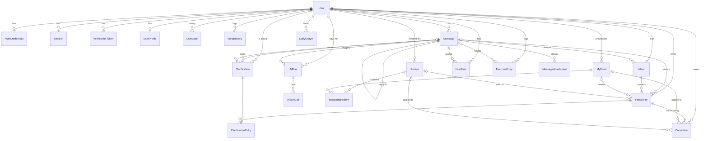

# База даних «Кусь»

PostgreSQL + Prisma 7 (адаптер `PrismaPg`). Джерело правди — [`apps/api/prisma/schema.prisma`](../apps/api/prisma/schema.prisma); цей документ пояснює _чому_ схема така. Перед зміною поля чи моделі звіряйся зі схемою, а не з цим файлом.

## Конвенції

- **id** — `uuid(7)` (`@db.Uuid`): сортується за часом створення. Курсор пагінації береться по тому ж полю, за яким сортуємо. Стрічка чату сортується й пагінується за `id`: `created_at` ставить БД з мікросекундами, а JS `Date` їх обрізає до мілісекунд, тож курсор за часом пропускав би рядки. Генерує Prisma Client, не БД — при вставці сирим SQL id треба передати самому.
- **Назви** — моделі й поля в коді PascalCase/camelCase, таблиці, колонки й enum-типи в БД — snake_case (`@@map` / `@map`).
- **Дати** — `timestamptz`. `localDate` (`date`) — календарний день користувача; рахує бекенд з моменту події й `User.timezone` (за замовчуванням `Europe/Warsaw`). Усі «денні» запити йдуть за `localDate`, не за UTC-датою.
- **Числа** — харчові значення `Float` (г, ккал), гроші — `Decimal(12,8)` у USD.
- **Soft delete** (`deletedAt`) — `Meal`, `FoodEntry`, `MyFood`, `Recipe`, `UserFact`, `ExerciseEntry`. Кожен запит до них — з фільтром `deletedAt: null`. Видалення = встановити `deletedAt`, «скасувати» в чаті = повернути `deletedAt = null`. Записи дня фільтруються **і** за `entry.deletedAt: null`, **і** за `meal.deletedAt: null`; видалення прийому ставить `deletedAt` прийому й усім його записам в одній транзакції.
- **Ізоляція даних** — кожна сутність користувача має `userId` з `onDelete: Cascade`. Чисто дочірні таблиці (`MessageAttachment`, `AiToolCall`, `RecipeIngredient`, `ClarificationEntry`) `userId` не мають — до них ходимо лише через батька, який уже відфільтрований за `userId`.
- **Чужі id (IDOR)** — БД не гарантує, що зв'язані сутності належать тому самому користувачу (`FoodEntry.mealId`, `myFoodId`, `recipeId`, `Correction.foodEntryId`, `Clarification.messageId` тощо). Тому **кожен id, отриманий від клієнта чи від AI-інструмента**, сервіс перевіряє через `findFirst({ where: { id, userId, deletedAt: null } })` перед тим, як використати чи прив'язати. Кожен такий ендпоінт чи AI-інструмент **обов'язково покривається IDOR-тестом**: другий користувач намагається прочитати, змінити чи прив'язати чужий id → `404`, дані не змінено. Складені FK `(id, userId)` у v0.1 свідомо не робимо — див. [Відкладено](#відкладено).
- **Видалення акаунта** — жорстке `DELETE` користувача стирає всі його дані каскадом (RODO). Перевірено: після видалення demo-користувача всі таблиці порожні.
- **Партіальні unique** (`Meal`, `MyFood`, `Recipe`) — Prisma показує їх як звичайні compound-ключі (`userId_localDate_type`, `userId_nameNormalized`), але не знає про предикат. Тому для цих моделей **заборонено `upsert` і `findUnique` за compound-ключем**: `upsert` шле `ON CONFLICT` без предиката, і PostgreSQL падає («no unique or exclusion constraint matching the ON CONFLICT specification»), а `findUnique` може повернути видалений рядок. Лише `findFirst` з `deletedAt: null`; find-or-create — через `ON CONFLICT … WHERE <предикат індексу> DO NOTHING` + `findFirst`. Ловити `P2002` і перечитувати в тій самій interactive-транзакції не можна: після помилки унікальності PostgreSQL переводить транзакцію в стан aborted. Для `DailyUsage` і `UserGoal` unique повний, тож `upsert` там коректний.
- **Enum'и** — у схемі; ті самі значення як zod-enum'и в [`packages/shared/src/schemas/enums.ts`](../packages/shared/src/schemas/enums.ts). `Locale` — виняток у lowercase (`uk`/`pl`/`en`), бо це коди i18n. `FoodCategory` — теж lowercase snake_case (`cottage_cheese`): значення збігаються з назвами іконок у `apps/web` і з текстом для AI ([`design/docs/food-categories.md`](../design/docs/food-categories.md)). Відповідність перевіряє `enums-sync.spec.ts`.

## Діаграма зв'язків



`|o` — необов'язковий зв'язок (`onDelete: SetNull`), `||` — обов'язковий (`onDelete: Cascade`).

## Моделі

### Користувач і доступ

- **User** — акаунт. `email` унікальний, зберігається в lowercase: нормалізує бекенд (zod), а БД гарантує через `CHECK users_email_lowercase_check`, тож акаунт-дубль, що відрізняється лише регістром, неможливий. `timezone` визначає «день» користувача. `addressAs` — «Як до тебе звертатися?» з профілю (до 30 символів, `PATCH /users/me`): привітання бере його з пріоритетом над кличним відмінком `name`. `emailVerifiedAt` знадобиться перед бетою. `consentAt` — коли користувач погодився на обробку даних про харчування й вагу (RODO): реєстрація приймає лише `consent: true`, а час ставить сервер, не клієнт; `null` — акаунти, створені до появи згоди. `deletionRequestedAt` / `purgeAt` — видалення акаунта з 30 днями на відновлення (`POST /account/delete` з паролем, `POST /account/restore`): поки `purgeAt` не `null`, глобальний `PendingDeletionGuard` відповідає `403 ACCOUNT_PENDING_DELETION` на все, крім restore, logout і `GET /users/me`; щоденний job `AccountPurgeService` (04:00, індекс `users(purge_at)`) робить жорсткий `DELETE` прострочених, і всі таблиці користувача зникають каскадом. Email лишається зайнятим до purge.
- **AuthCredentials** (1:1, PK = `userId`) — argon2-хеш пароля, лічильник невдалих входів і `lockedUntil` для захисту від brute-force. Окрема таблиця, бо користувач з Google OAuth її не матиме.
- **Session** — refresh-токен (лише хеш). Кожна ротація — новий рядок з тим самим `tokenFamily`, старий отримує `usedAt`. Повторне використання токена з `usedAt` → відкликати всю `tokenFamily` (крім одноразового повтору в 20-секундному grace-вікні — без зміни схеми, див. `architecture.md`). Одна `tokenFamily` = один вхід (пристрій); access-токен несе її id, і guard на кожному запиті перевіряє, що в сім'ї є активна сесія — тож logout і відкликання діють одразу. Потік токенів — [`architecture.md`](architecture.md#auth).
- **VerificationToken** — одноразові токени підтвердження email і скидання пароля (лише хеш).

### Профіль і цілі

- **UserProfile** (1:1) — «Мої дані»: стать, рік народження, зріст, рівень активності, бажана вага, ціль (`goalType`) і темп (`paceKgPerWeek`: 0,25 / 0,5 / 0,75, завжди додатний; `null` для MAINTAIN) — вхід для `calculateGoals` у `packages/shared`. `birthYear` назовні не виходить: `GET/PATCH /profile` працюють з `age`, сервіс переводить через поточний рік у `User.timezone` (тому в день народження вік може «стрибнути» на рік); вік лише 18–100 — Kusik для дорослих (`AGE_BELOW_MINIMUM`). У zod профілю лише 4 рівні активності; `VERY_ACTIVE` лишається в enum без використання.
- **UserGoal** — історія цілей. Ціль на день D — запис з найбільшим `validFrom <= D`, тож минулі дні рахуються за ціллю, що діяла тоді. Одна ціль на день (`unique(userId, validFrom)`): повторна зміна того ж дня перезаписує її. `source` — `CALCULATED` (сервер порахував з профілю, `PUT /profile/goals { source: "calculated" }`) або `MANUAL` (числа вручну: `PUT /profile/goals { source: "manual", … }` з перевіркою `|4Б + 4В + 9Ж − ккал| ≤ 15 %`, або `PUT /goals/current` з чату); дефолт `MANUAL` переніс цілі, створені до розрахунку. `targetWeightKg` більше не пишеться — див. [Відкладено](#відкладено).
- **WeightEntry** — зважування: одне на локальний день (`unique(userId, localDate)`, повторне того ж дня перезаписує), вага з одним знаком після коми. «Вага зараз» у профілі — останній запис; `PATCH /profile { weightKg }` робить upsert на сьогодні.

### Чат і AI

- **Message** — один безперервний чат на користувача (моделі Conversation немає). `clientMessageId` генерує клієнт; `unique(userId, clientMessageId)` робить надсилання ідемпотентним (дубль-клік не створює два повідомлення). У повідомлень асистента `clientMessageId` немає — NULL в унікальному індексі не конфліктують. `replyToId` пов'язує відповідь асистента з повідомленням користувача. `content` порожній для повідомлення лише з фото.
- **MessageAttachment** — метадані фото. `storageKey` nullable: у v0.1 оригінали не зберігаємо.
- **AiRun** — кожен виклик моделі: `purpose`, модель, токени, вартість, тривалість, статус, `errorCode`. `messageId` опційний (не кожен виклик прив'язаний до повідомлення) і з `SetNull`, щоб облік вартості не губився. Текст повідомлень тут не зберігається.
- **AiToolCall** — виклики інструментів у межах run: назва, вхід і результат (Json) для налагодження промпту. `name` — рядок, не enum: невідомі інструменти, які «вигадала» модель, теж мають логуватися. `REJECTED` — вхід не пройшов zod. `input`/`result` містять розібрану їжу (назви продуктів, грами) — це дані про харчування (RODO). **Правило: зберігаються 30 днів** — потрібні лише для налагодження промпту; старші видаляє щоденний job `AiCleanupService` (`@nestjs/schedule`, 03:00, індекс `ai_tool_calls(created_at)`). Видалення акаунта стирає їх одразу, каскадом.
- **Clarification** — питання від AI (`messageId` — повідомлення асистента, `answerMessageId` — відповідь користувача), варіанти, `impactKcal`, статус. Кожен варіант зберігає повні значення пов'язаних записів (`kcal`, `protein`, `fat`, `carbs`, `fiber`, `grams` — лише якщо відповідь міняє вагу, `name` — нова назва для питання про одну позицію); тап по варіанту (`POST /clarifications/:id/answer`) розподіляє їх між записами пропорційно поточним ккал, пише `Correction` (лише змінені поля) і ставить `ANSWERED` з `answerOptionIndex` і `answer` = підпис варіанта. Відповідь словами в чаті (`resolve_clarification`) — той самий шлях: `answer` = слова користувача, `answerMessageId` = його повідомлення, `answerOptionIndex` лише якщо названо варіант. Через **ClarificationEntry** пов'язане з записами, яких стосується (m2m: одне питання може стосуватися кількох записів, а запис — кількох питань).

### Їжа

- **Meal** — прийом їжі: тип, `eatenAt`, `localDate`, повідомлення-джерело.
  **Правило:** на один `(userId, localDate, type)` — один активний Meal. Бекенд додає нові записи в наявний прийом того ж дня й типу, а не створює дубль. Гарантується в БД партіальним unique `meals(user_id, local_date, type) WHERE deleted_at IS NULL AND type <> 'OTHER'`, тож паралельні запити не створять два обіди. Find-or-create прийому — `createMany({ skipDuplicates: true })` (це `INSERT … ON CONFLICT DO NOTHING` без target, який спрацьовує й на партіальному індексі й не перериває транзакцію; id генерує Prisma), потім `findFirst` з `deletedAt: null` у тій самій транзакції (див. правило про партіальні unique нижче в «Конвенціях»). `OTHER` може повторюватися протягом дня. Окремий повний індекс на ті ж колонки обслуговує денні запити (партіальний не містить `OTHER` і видалених).
- **FoodEntry** — запис їжі в межах Meal. Ккал і макроси — **snapshot**: зміна MyFood чи Recipe не змінює минулі дні. `myFoodId` / `recipeId` — звідки взято значення (`SetNull` при видаленні). `isEdited` — користувач правив запис. `sourceMessageId` — повідомлення користувача, з якого прийшов запис: Meal спільний на день + тип, тож лише за ним картка в чаті знає, які записи додало саме це повідомлення (`SetNull`). `category` (`FoodCategory`, default `plate`) — лише іконка страви, на цифри не впливає; теж **snapshot**: запис із пам'яті копіює категорію MyFood чи Recipe, і зміна її там не перемальовує минулі дні. `localDate` береться з Meal (join), щоб не було розсинхрону при перенесенні запису.
- **MyFood** — «мої продукти». Значення зберігаються **лише на 100 г**. `category` (default `plate`) — іконка, яку отримує кожен запис із цього продукту.
  **Правило:** якщо етикетка дає значення на 1 шт, бекенд перераховує їх у значення на 100 г через `pieceGrams` (`per100g = perPiece / pieceGrams * 100`) і зберігає `pieceGrams`. Значення на штуку рахуються назад (`per100g * pieceGrams / 100`) — одне джерело правди.
  `nameNormalized` і `aliases` зберігаються нормалізованими (lowercase, trim, одинарні пробіли). Назва унікальна в межах користувача серед **не видалених** продуктів (partial unique `WHERE deleted_at IS NULL`, preview `partialIndexes`) — видалений продукт не заважає створити новий з тією ж назвою.
- **Recipe** + **RecipeIngredient** — рецепти. Підсумки не зберігаються: бекенд сумує інгредієнти, а `cookedGrams` (вага готової страви) дає значення на 100 г готового. Унікальність назви — як у MyFood. `category` (default `plate`) — іконка страви цілком (сирники → `pancakes`), не інгредієнтів.
- **Correction** — виправлення запису користувачем (тапом по уточненню чи текстом у чаті). `before` / `after` — Json лише зі змінених полів (`{ "grams": 120 }` → `{ "grams": 150 }`; назва, категорія, кількість теж), для видалення / відновлення — `{ "deleted": false }` → `{ "deleted": true }`. `myFoodId` / `recipeId` — куди виправлення застосовано, `savedToMemory` — чи оновили пам'ять.
- **UserFact** — факти про користувача (вподобання, звички, обмеження). AI пропонує (`PROPOSED`), користувач підтверджує або відхиляє; у контекст моделі йдуть лише `CONFIRMED`.

### Ліміти й пізніші модулі

- **DailyUsage** — лічильники за **локальний** день користувача (повідомлення, фото, вартість AI) для денних лімітів. Інкремент атомарний: `upsert` + `increment` по `unique(userId, localDate)`. Відомий компроміс: зміна timezone може «скинути» ліміт раніше.
- **ExerciseEntry** — після MVP: активність, тривалість, спалені ккал, джерело.

## Індекси

| Таблиця               | Індекс                                                                                                      | Запит                                             |
| --------------------- | ----------------------------------------------------------------------------------------------------------- | ------------------------------------------------- |
| sessions              | `refresh_token_hash` UNIQUE; `token_family`; `(user_id, expires_at)`                                        | refresh-ротація, відкликання сім'ї, активні сесії |
| verification_tokens   | `token_hash` UNIQUE; `(user_id, type)`                                                                      | перевірка токена, інвалідація старих              |
| user_goals            | `(user_id, valid_from)` UNIQUE                                                                              | ціль на дату                                      |
| weight_entries        | `(user_id, local_date)`                                                                                     | вага за період                                    |
| messages              | `(user_id, created_at)`; `(user_id, client_message_id)` UNIQUE; `reply_to_id`                               | останні N повідомлень, ідемпотентність            |
| message_attachments   | `message_id`                                                                                                | фото повідомлення                                 |
| ai_runs               | `(user_id, created_at)`; `message_id`                                                                       | вартість за період                                |
| ai_tool_calls         | `ai_run_id`; `created_at`                                                                                   | налагодження; чищення старших 30 днів             |
| clarifications        | `(user_id, status)`; `message_id`; `answer_message_id`                                                      | відкриті уточнення                                |
| clarification_entries | PK `(clarification_id, food_entry_id)`; `food_entry_id`                                                     |                                                   |
| meals                 | partial UNIQUE `(user_id, local_date, type)` WHERE не видалено й не `OTHER`; `(user_id, local_date, type)`  | пошук наявного прийому без дублів; записи дня     |
| food_entries          | `meal_id`; `(user_id, created_at)`; `my_food_id`; `recipe_id`; `source_message_id`                          | записи прийому, останні записи, картки чату       |
| my_foods              | partial UNIQUE `(user_id, name_normalized)`; GIN `aliases`; `(user_id, last_used_at)`; `(user_id, barcode)` | пошук за назвою й alias, «часті», штрихкод        |
| recipes               | partial UNIQUE `(user_id, name_normalized)`; GIN `aliases`; `(user_id, last_used_at)`                       | те саме                                           |
| recipe_ingredients    | `recipe_id`; `my_food_id`                                                                                   |                                                   |
| corrections           | `food_entry_id`; `(user_id, created_at)`; `my_food_id`; `recipe_id`                                         |                                                   |
| user_facts            | `(user_id, status)`                                                                                         | факти в контекст AI                               |
| daily_usage           | `(user_id, local_date)` UNIQUE                                                                              | ліміти                                            |
| exercise_entries      | `(user_id, local_date)`                                                                                     |                                                   |

## Відкладено

Свідомі рішення «не зараз» — з моментом, коли до них повертаємося.

| Що                                                                                                                                                             | Чому не зараз                                                                                                                                                                                                                  | Коли повертаємося                                                              |
| -------------------------------------------------------------------------------------------------------------------------------------------------------------- | ------------------------------------------------------------------------------------------------------------------------------------------------------------------------------------------------------------------------------ | ------------------------------------------------------------------------------ |
| Складені FK `(id, userId)` (Meal → FoodEntry, FoodEntry → Correction / ClarificationEntry, Message → Clarification) — належність гарантує БД, а не лише сервіс | Ускладнює схему й міграції; у v0.1 один користувач, а перевірку в сервісах страхують IDOR-тести. Для опційних `SetNull`-зв'язків не підходить (обнулило б і `userId`)                                                          | Перед бетою для інших (етап 7)                                                 |
| Нечіткий пошук за назвою (`pg_trgm`, GIN `gin_trgm_ops`)                                                                                                       | У користувача десятки–сотні продуктів, кандидатів для AI простіше відфільтрувати в пам'яті                                                                                                                                     | Коли пошук у пам'яті стане повільним або неточним (етап 5)                     |
| `btree_gin` на `(user_id, aliases)` замість GIN лише на `aliases`                                                                                              | Поки користувачів мало, GIN без `user_id` не сканує зайвого                                                                                                                                                                    | Перед бетою, якщо пошук за alias з'явиться в профілі запитів                   |
| Відповідь на логін під час блокування — той самий `INVALID_CREDENTIALS` замість `ACCOUNT_LOCKED` (повністю без enumeration)                                    | Зараз `ACCOUNT_LOCKED` (423) видає, що акаунт існує (5 невдалих спроб на неіснуючий email блокування не дають). У v0.1 один користувач і закрита реєстрація, а зрозуміла помилка важливіша; витік стримує throttler 5/хв по IP | Перед бетою для інших (етап 7)                                                 |
| Індекси `sessions(expires_at)` і `verification_tokens(expires_at)` для чищення прострочених                                                                    | Чищення ще немає: у v0.1 сесій одиниці, прострочені й відкликані нікому не заважають                                                                                                                                           | Разом з job чищення сесій (етап 7)                                             |
| Прибрати колонку `user_goals.target_weight_kg` (TODO) — бажана вага переїхала в `UserProfile`, код її більше не пише                                           | Видалення колонки — у два деплої (`deploy.md`): спершу код перестає її читати (зроблено), потім міграція. На проді в ній старі значення, які ще можуть знадобитися для «з 5 вересня»                                           | Наступна міграція після етапу 6A, коли `UserProfile.targetWeightKg` заповнений |

## Команди

```bash
pnpm db:up        # локальна PostgreSQL у Docker
pnpm db:migrate   # prisma migrate dev — створити/застосувати міграції
pnpm db:seed      # демо-дані (demo@kus.local); ідемпотентно перестворює demo-користувача
pnpm db:studio    # Prisma Studio
```

Seed містить лише **вигадані** дані й відмовляється працювати з `NODE_ENV=production` або з нелокальним `DATABASE_URL` (обхід — явний `SEED_ALLOW_REMOTE=1`). Синхронність enum'ів схеми й shared перевіряє тест `apps/api/src/prisma/enums-sync.spec.ts`. Demo-користувач отримує пароль, лише якщо в `apps/api/.env` задано `SEED_DEMO_PASSWORD` (мінімум 10 символів); без неї `AuthCredentials` не створюється й увійти ним не можна.

E2E-тести бекенду працюють на окремій базі `kus_test` на тому ж сервері (`pnpm db:up`): її створює й мігрує `apps/api/test/db-global-setup.ts`, а перед кожним тестом таблиці очищаються (`TRUNCATE`). Захист — лише локальний хост і назва `*_test`.
